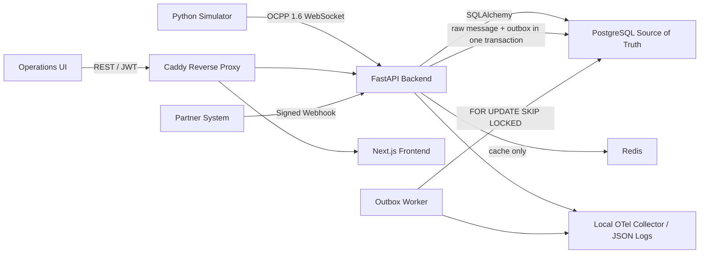

# Architecture

The demo is intentionally a backend lifecycle slice. The important path is that inbound OCPP or partner webhook input is written durably before asynchronous processing is attempted. Redis is never used as a workflow source of truth.

# Runtime Responsibilities

- `backend`: REST APIs, JWT auth, OCPP WebSocket endpoint, partner webhook receiver, structured logs, metrics, traces.
- `worker`: outbox polling, stale lock recovery, retry/backoff, dead-letter handling.
- `postgres`: durable state for sites, stations, connectors, sessions, transactions, raw messages, outbox, partner events, users, roles, and audit events.
- `redis`: cache/readiness dependency only.
- `simulator`: predefined OCPP and partner scenarios.
- `frontend`: operations UI for fleet state, sessions, messages, webhooks, simulator, system health, and admin actions.
- `caddy`: one public entry point for frontend, API, OCPP, and simulator routes.

# Reliability Points

- Raw OCPP messages and outbox rows are created in the same DB transaction.
- OCPP message IDs are unique and duplicate calls return idempotent responses.
- Duplicate meter samples are ignored and audited.
- Worker selection uses PostgreSQL row locking.
- Stale `processing` locks are recovered back to retryable work.
- Dead-letter acknowledgement preserves the terminal `dead_lettered` status and records acknowledgement metadata.
